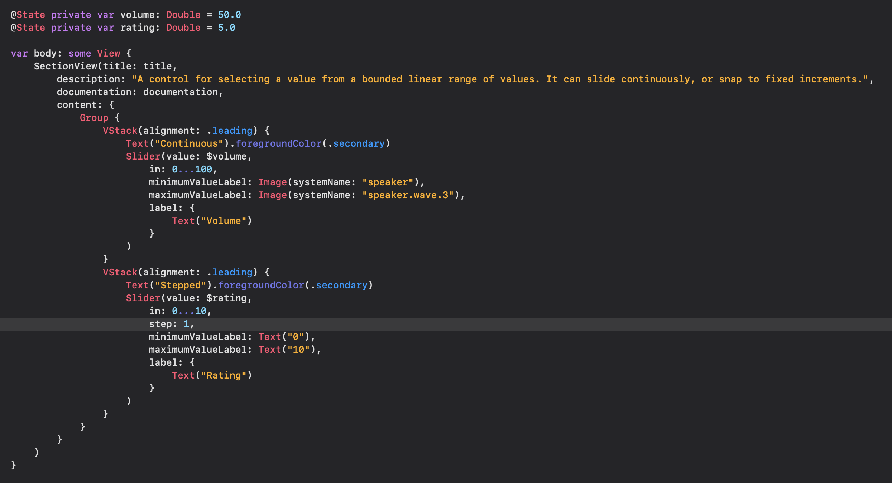
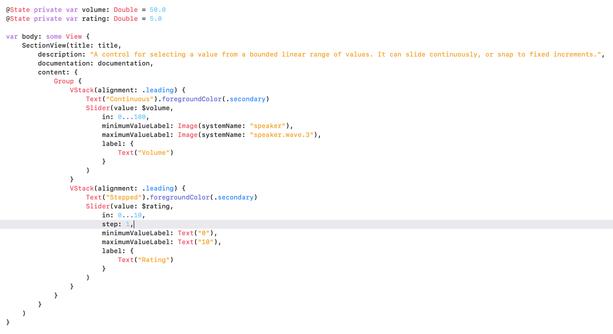

# Interact Theme
Color theme for Xcode based on [Interact](https://apps.apple.com/us/app/interact-a-field-guide/id1528095640)

## How to Use
1. Download this repository
2. Open Finder
3. Click "Go" in the Menu Bar and select "Go to Folder..." or press ⇧⌘G
4. Paste `~/Library/Developer/Xcode/UserData/FontAndColorThemes/` into the text field and click "Go"
5. Unzip `Interact Theme.zip` from the repository and copy the `.xccolortheme` files to the directory you just opened
7. Open preferences in Xcode and select `Interact (Dark)` or `Interact (Light)` in the "Theme" tab (you must restart Xcode if it was already open)

## Examples

