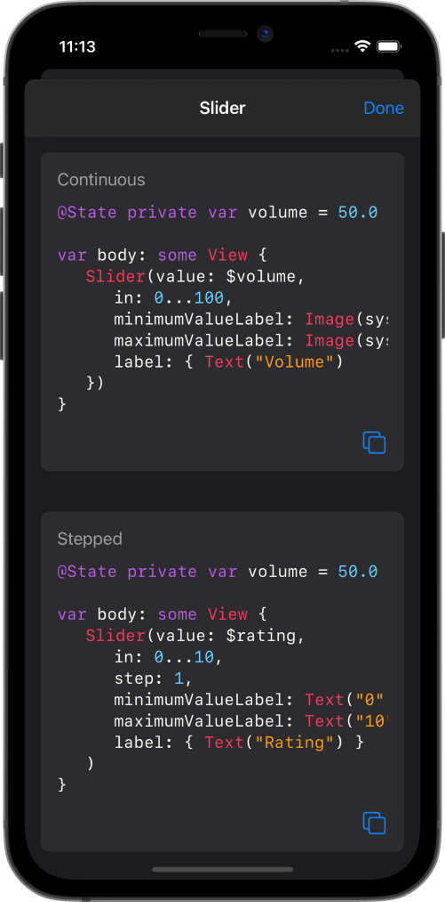

# Interact
Color scheme for Xcode based on the [Interact](https://apps.apple.com/us/app/interact-a-field-guide/id1528095640) app

## Example

## How to Use
1. Download this repository and unzip the `Interact Theme.zip` file
2. Open Finder
3. Click "Go" in the Menu Bar and select "Go to Folder..." or press ⇧⌘G
4. Paste the following direction `~/Library/Developer/Xcode/UserData/FontAndColorThemes/` and select "Go"
5. Copy the `Interact (Dark).xccolortheme` to the preceding directory
7. Open Xcode preferences and select "Interact (Dark)" in the "Theme" tab (if Xcode was already open, you'll need to restart it)